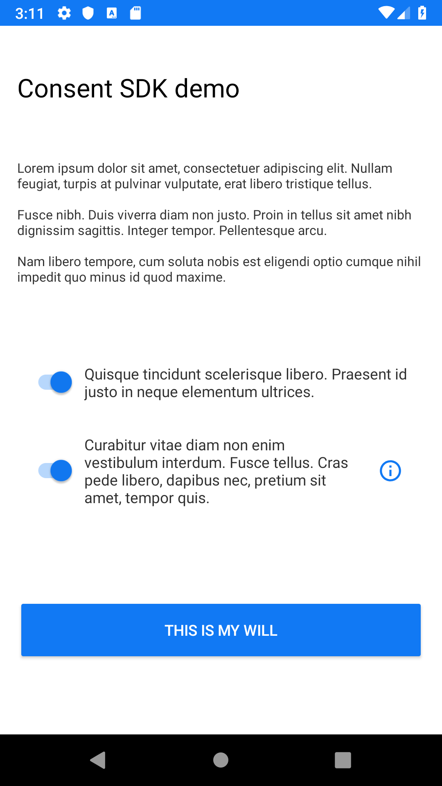
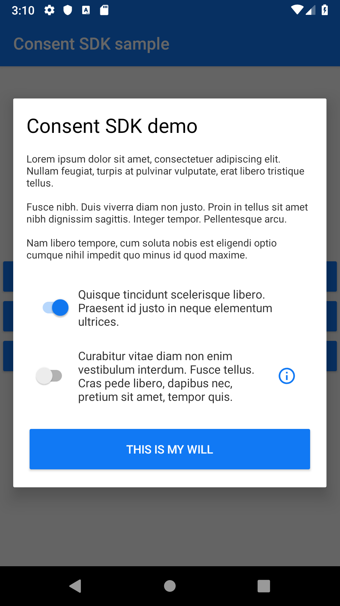

# Consent SDK for Android

Obtaining explicit user consent with gathering analytics data in an app, or with processing user’s personal data is important part of establishing user trust and seamless user experience.

Although implementing some dialog to obtain user consents and store them for further reference seems pretty straightforward, digging into it reveals (as usual with “simple tasks”) many programming and design details that must be implemented, which are not the core functionality of your app.

So why not use or reuse some ready-made SDK?

  

## Consent SDK main functionality

- Provides configurable __consent form__ that can be displayed as:
  - __Dialog__
  - __FragmentDialog__(persists orientation changes)
  - __Activity__
- Stores consent grant results and provides access methods.

## Instalation

todo

## How to use

Firstly you need to instantiate `ConsentSDK` with `applicationContext`.

```
val consentSDK = ConsentSDK(application)
```

This object is gonna be used for all interaction with ConsentSDK.

### Consent form data

Before you can display consent form you need to prepare consent form data.

```
companion object {
    const val CONSENT_1_KEY = "consent_1_key"
    const val CONSENT_2_KEY = "consent_2_key"
}

...

val consentFormItems = arrayOf(
    ConsentFormItem(
        consentKey = CONSENT_1_KEY,
        required = true,
        description = getString(R.string.consent_1_description),
        link = null
    ),
    ConsentFormItem(
        consentKey = CONSENT_2_KEY,
        required = false,
        description = getString(R.string.consent_2_description),
        link = getString(R.string.consent_2_link)
    )
)

val consentFormData = ConsentFormData(
    titleText = getString(R.string.consent_form_title),
    descriptionText = getString(R.string.consent_form_description),
    confirmButtonText = getString(R.string.consent_form_confirm_button_text),
    consentFormItems = consentFormItems)

```

Array `consentFormItems` represents consents we want user to grant us. Every item needs have:
 - unique `consentKey` that represents it and can be used to obtain grant result for this consent.
 - `required` flag. If this flag is set to `true` user cannot successfully finish consent form without granting this consent.
 - `descriptionText` informing user about the consent.
 - `link` (optional) that lest user open web page (URL) with more info.
 
 Object `consentFormData` provides all needed data for displaying consent form.

### Showing consent form on `Dialog`
Most simple and straight-forward way of displaying consent form is on `Dialog`. It has one __drawback__, this way we __cannot__ properly persist user data on orientation change. Use this if you have locked screen orientation.

```
consentSDK.showConsentFormDialog(consentFormData, object : ConsentResultListener {
    override fun onConsentResult(consentResults: HashMap<String, Boolean>) {
        // consent form result here
    }
})
```

### Showing consent form on `DialogFragment`
By using `DialogFragment` SDK can properly handle orientation changes.

```
consentSDK.showConsentFormDialogFragment(<activity>/<fragment>, consentFormData)
```

First parameter of `showConsentFormDialogFragment` accepts `Activity` or `Fragment` reference so you can call it from both.
You calling `Activity` or `Fragment` __must__ implement ConsentResultListener.

```
class SampleActivity : AppCompatActivity(), ConsentResultListener {

...

  override fun onConsentResult(consentResults: HashMap<String, Boolean>) {
      // consent form result here
  }
}
```

### Starting consent form `Activity`

```
class SampleActivity : AppCompatActivity() {

  companion object {
      const val CONSENT_REQUEST_CODE = 10001
  }

  ...

  consentSDK.startConsentFormActivity(this, consentFormData, CONSENT_REQUEST_CODE)

  ...

    override fun onActivityResult(requestCode: Int, resultCode: Int, data: Intent?) {
        if (requestCode == CONSENT_REQUEST_CODE) {
            if (resultCode == Activity.RESULT_OK) {
                val consentResults = consentSDK.getConsentResult(data)
            }
        }
    }
}
```

Consent form `Activity` is started "for a result" so to get a result you need to implement `onActivityResult` method in your `Activity`. 

### Creating conset form `Fragment`
todo

## Styling
todo

